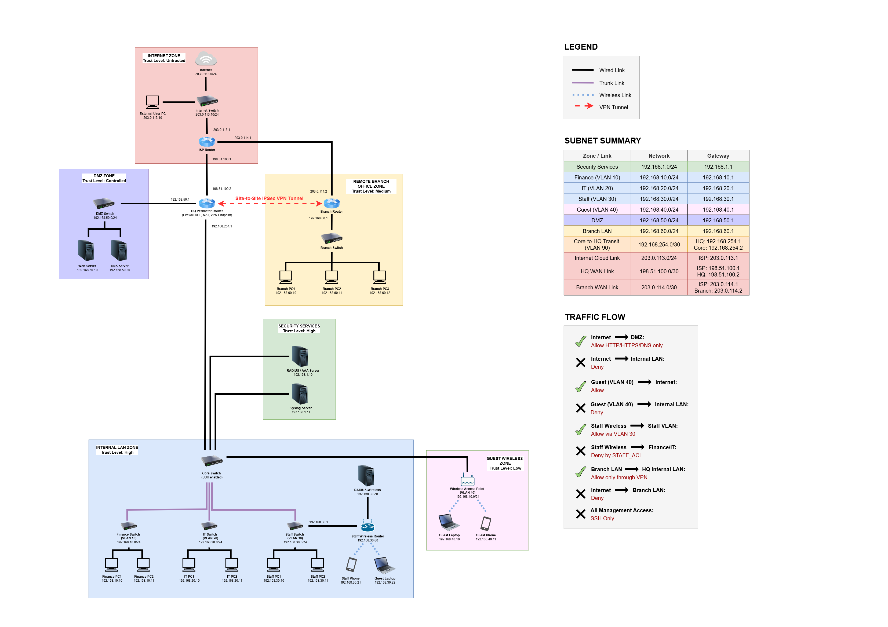

# SecureFlow Network Security Lab

> A defence-in-depth enterprise network designed and tested in Cisco Packet Tracer, featuring network segmentation, access control, secure administration, centralised authentication, logging, NAT, a DMZ, wireless isolation, and a site-to-site IPsec VPN.

## Overview

SecureFlow is a simulated corporate network created to explore how multiple security controls work together to protect an organisation's headquarters, branch office, internal departments, public services, and wireless users.

The network applies a defence-in-depth approach rather than relying on a single control. VLANs and access control lists restrict lateral movement, the DMZ separates public services from internal systems, AAA and SSH protect administrative access, and an IPsec tunnel secures communication between the headquarters and branch office.

This project was developed as a university group assignment using Cisco Packet Tracer. It is intended for education and portfolio demonstration only.

## Project Objectives

- Segment departments and services according to their security requirements.
- Restrict unauthorised communication between internal network zones.
- Isolate internet-facing services from the internal network through a DMZ.
- Allow only approved inbound traffic from the external network.
- Protect traffic exchanged between the headquarters and branch office.
- Secure network-device administration using SSH and centralised authentication.
- Collect network events through centralised Syslog logging.
- Test each control using expected-versus-actual verification results.
- Relate the design to recognised security and compliance practices.

## Network Architecture

The simulated environment contains:

- A headquarters network with departmental VLANs
- A Layer 3 core switch providing inter-VLAN routing through SVIs
- A perimeter router providing filtering, NAT, and VPN connectivity
- A DMZ containing public web and DNS services
- A remote branch network connected through a site-to-site VPN
- Staff and guest wireless networks with different access permissions
- Centralised RADIUS and Syslog services
- An external network used to test perimeter restrictions

> **Add the final topology image here:** save it as `diagrams/secureflow-topology.png`.

```markdown

```

## Security Controls Implemented

| Control | Purpose |
|---|---|
| VLAN segmentation | Separates departments, guests, management services, and the DMZ into different security zones. |
| Inter-VLAN ACLs | Permits required business traffic while restricting unauthorised lateral movement. |
| Perimeter filtering | Blocks unsolicited access to internal networks and permits only approved public services. |
| DMZ isolation | Places public web and DNS services outside the trusted internal network. |
| NAT | Translates internal addresses for external connectivity and exposes only approved DMZ services. |
| Site-to-site IPsec VPN | Protects traffic exchanged between the headquarters and branch office. |
| AAA with RADIUS | Centralises authentication for network-device administration, with local fallback where configured. |
| SSH version 2 | Provides encrypted command-line management and prevents Telnet-based administration. |
| Centralised Syslog | Sends device events to a central location for monitoring and investigation. |
| Wireless access restrictions | Separates staff and guest access and limits guest connectivity to authorised destinations. |
| Switch hardening | Uses controls such as port security, PortFast, and BPDU Guard where supported and configured. |

## Access-Control Policy

The design follows least privilege and default-deny principles:

- Guest devices must not reach protected internal VLANs.
- Staff users may access only the services required for their role.
- External devices must not initiate connections to internal networks.
- External access to the DMZ is limited to approved web and DNS services.
- Administrative access to network devices uses SSH instead of Telnet.
- HQ-to-branch traffic is protected by the IPsec tunnel when it matches the VPN policy.

## Verification and Results

The controls were evaluated using connectivity tests, service requests, Packet Tracer simulation events, and Cisco IOS verification commands.

| Test | Expected result | Result |
|---|---|---|
| Guest network to protected internal VLANs | Blocked | Passed |
| Staff network to restricted VLANs | Blocked | Passed |
| External device to internal networks | Blocked | Passed |
| External device to approved DMZ services | Allowed | Passed |
| Authorised inter-VLAN traffic | Allowed | Passed |
| SSH administrative login | Allowed | Passed |
| Telnet administrative login | Blocked | Passed |
| HQ-to-branch protected traffic | Encrypted by IPsec | Passed |

Evidence for these tests should be placed in the [`evidence/`](evidence/) directory. Each image should show the test being performed and the relevant device output.

## Useful Verification Commands

```text
show vlan brief
show interfaces trunk
show ip interface brief
show ip route
show access-lists
show port-security
show ip nat translations
show crypto isakmp sa
show crypto ipsec sa
show ip ssh
show logging
show running-config
```

## Tools and Frameworks

| Tool or framework | Use in the project |
|---|---|
| Cisco Packet Tracer | Network design, configuration, simulation, and testing |
| Cisco IOS CLI | Configuration and verification of network controls |
| diagrams.net (draw.io) | Network-topology design and documentation |
| Kali Linux and OpenSSL | TLS protocol and handshake testing |
| MXToolbox | SPF, DKIM, and DMARC configuration checks |
| STRIDE | Threat identification and classification |
| NIST Cybersecurity Framework 2.0 | Mapping controls to security outcomes |

## Repository Structure

```text
secureflow-network-security-lab/
├── README.md
├── lab/
│   └── secureflow-network.pkt
├── configs/
│   ├── core-switch.txt
│   ├── hq-perimeter-router.txt
│   └── branch-router.txt
├── diagrams/
│   └── secureflow-topology.png
├── docs/
│   ├── report.pdf
└── evidence/
    ├── vlan-segmentation/
    ├── acl-testing/
    ├── nat/
    ├── vpn/
    ├── aaa-radius/
    ├── ssh/
    ├── syslog/
    └── wireless-isolation/
```

## How to Explore the Lab

1. Install Cisco Packet Tracer.
2. Download or clone this repository.
3. Open `lab/secureflow-network.pkt` in Packet Tracer.
4. Allow the simulated devices to finish booting and converging.
5. Inspect the topology and device configurations.
6. Test and compare your results with the screenshots under `evidence/`.

## Packet Tracer Limitations

- Packet Tracer simulates only a subset of the features available on production Cisco equipment.
- IKEv2 and SHA-256 support for the planned VPN configuration was limited, so the closest supported IPsec settings were used.
- The selected wireless components did not fully support the intended enterprise RADIUS design, requiring a simplified wireless configuration.
- Command-level AAA accounting was not fully supported; available accounting functionality was used instead.
- Syslog behaviour and log visibility were limited in the simulation.
- Some SVI ACL configurations did not persist reliably after reopening the Packet Tracer file.
- Testing used simulated ICMP, HTTP, DNS, and packet flows rather than real production traffic.
- Performance, high availability, traffic load, and real-world attack resilience were outside the project scope.

## Recommended Future Improvements

- Rebuild the design in GNS3, EVE-NG, or a physical lab for more realistic validation.
- Use WPA3-Enterprise and certificate-based authentication for corporate wireless access.
- Add DHCP snooping and Dynamic ARP Inspection to strengthen Layer 2 protection.
- Introduce IDS/IPS monitoring and a SIEM platform for improved alerting and investigation.
- Add multi-factor authentication for privileged administrative access.
- Deploy stronger production VPN algorithms with IKEv2 where fully supported.
- Test availability, failover, traffic load, and recovery procedures.
- Automate configuration checks and security validation.

## My Contribution

This project was completed as part of a three-person university assignment by Ariana Falisya, Damia Irdina, and Angela Wong.

**Before publishing, replace the list below with only the work you personally completed:**

- Designed and documented: `[add your sections]`
- Configured: `[add the devices and controls you implemented]`
- Tested: `[add the security tests you performed]`
- Researched and presented: `[add your report or presentation sections]`
